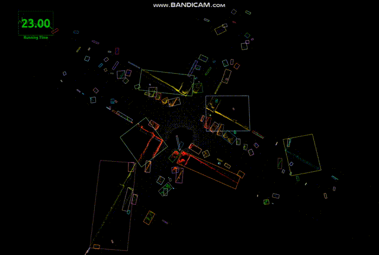

## Real-Time Fast Channel Clustering for LiDAR Point Cloud
A ROS implementation of "Real-Time Fast Channel Clustering for LiDAR Point Cloud"

## Reference
* Zhang, Xiao, and Xinming Huang. "Real-Time Fast Channel Clustering for LiDAR Point Cloud." IEEE Transactions on Circuits and Systems II: Express Briefs 69.10 (2022): 4103-4107.

## Dependencies
* semantic_kitti_loader
* obsdet_msgs

## How to use
    # clone the repo
    mkdir -p catkin_ws/src
    cd catkin_ws/src
    git clone https://github.com/HMX2013/SemanticKITTI_loader
    git clone https://github.com/HMX2013/FCC-ROS
    download obsdet_msgs from
    "https://drive.google.com/file/d/1ztLk9Slm656CV-WJieUpBJPlz-Iw14Bk/view?usp=share_link"
    cd ../
    catkin_make

    roslaunch fcc run_rviz.launch
    roslaunch semantic_kitti run_semantic.launch

## Contribution
You are welcome contributing to the package by opening a pull-request

We are following: 
[Google C++ Style Guide](https://google.github.io/styleguide/cppguide.html), 
[C++ Core Guidelines](https://isocpp.github.io/CppCoreGuidelines/CppCoreGuidelines#main), 
and [ROS C++ Style Guide](http://wiki.ros.org/CppStyleGuide)

## License
MIT License
